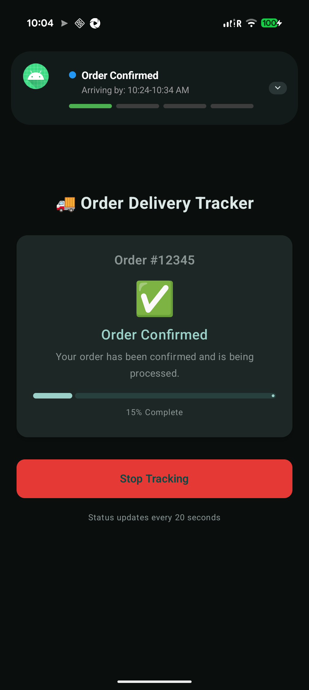
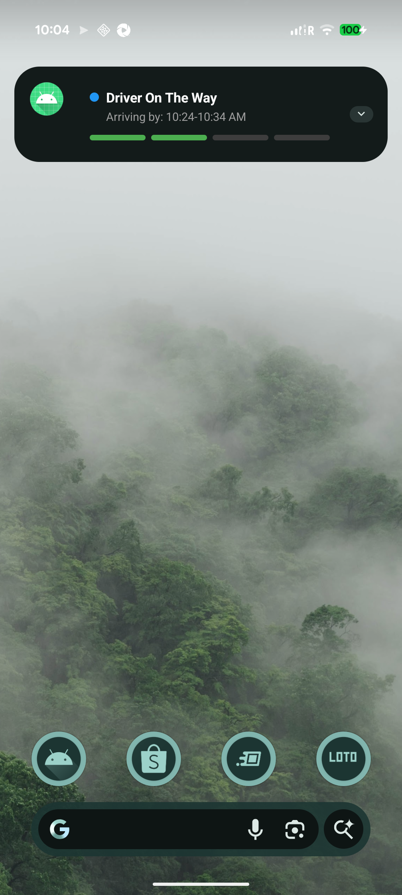
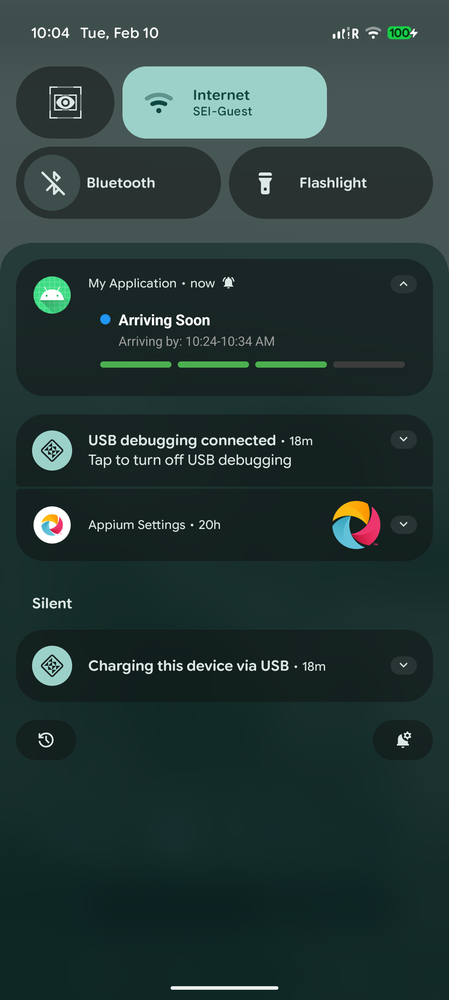
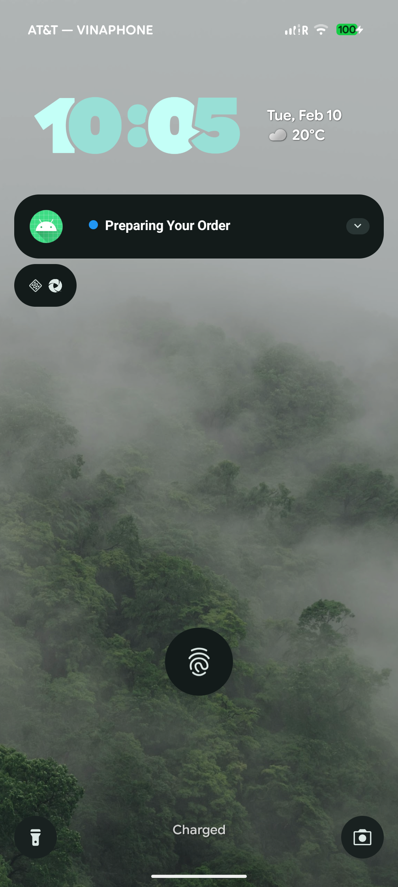

### Version-Specific Notification Building:

```kotlin
// Android 16+ (API 36+) - Native Notification.Builder
@RequiresApi(API_36)
private fun buildNotificationApi36(...): Notification {
    return Notification.Builder(context, CHANNEL_ID)
        .setForegroundServiceBehavior(Notification.FOREGROUND_SERVICE_IMMEDIATE)
        // ... latest APIs
        .build()
}

// Android 10-15 (API 29-35) - NotificationCompat
private fun buildNotificationCompat(...): Notification {
    return NotificationCompat.Builder(context, CHANNEL_ID)
        .setPriority(NotificationCompat.PRIORITY_HIGH)
        // ... backward compatible
        .build()
}
```

### API Coverage:

| Android Version | API Level | Notification Method |
|-----------------|-----------|---------------------|
| Android 10-12 | 29-32 | `NotificationCompat` (no permission needed) |
| Android 13-15 | 33-35 | `NotificationCompat` + POST_NOTIFICATIONS permission |
| Android 16+ | 36+ | Native `Notification.Builder` with latest APIs |

Rebuild and run to test across different Android versions.


# Wakeup 


To wake up the screen when a status update arrives, you have two main approaches:

## Option 1: Full-Screen Intent (Recommended for notifications)
Add a full-screen intent to your notification - Android will wake the screen automatically for high-priority notifications.

## Option 2: PowerManager Wake Lock
Manually acquire a wake lock with `ACQUIRE_CAUSES_WAKEUP` flag.

Here's how to implement **Option 1** (cleaner approach):

Added `.setFullScreenIntent(contentIntent, true)` to both notification builders.

**Required permission** — add this to your `AndroidManifest.xml`:

```xml
<uses-permission android:name="android.permission.USE_FULL_SCREEN_INTENT" />
```

Let me check your manifest:


## Summary

Implemented screen wake-up on status updates using **full-screen intent**:

1. **`@/Users/angu3018/Desktop/Temp/MyApplication2/app/src/main/java/com/example/myapplication/NotificationHelper.kt:118`** and **line 138** — Added `.setFullScreenIntent(contentIntent, true)` to both notification builders

2. **`@/Users/angu3018/Desktop/Temp/MyApplication2/app/src/main/AndroidManifest.xml:8`** — Added `USE_FULL_SCREEN_INTENT` permission

**How it works:**
- When the screen is off and a notification fires, the full-screen intent wakes the screen and shows your `MainActivity`
- When the screen is on, it displays a heads-up notification instead

**Note for Android 14+:** Users can revoke full-screen intent permission in Settings. You can check with `NotificationManager.canUseFullScreenIntent()` and prompt users to enable it if needed.